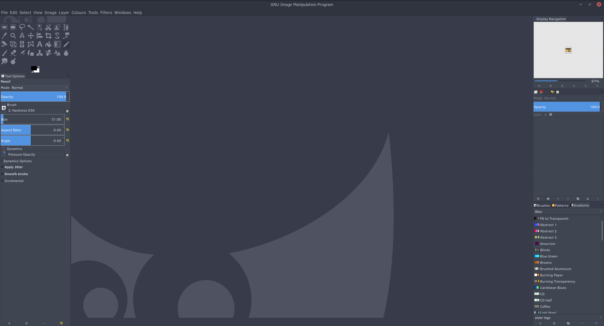

# Gimp HiDPI

A theme for HiDPI displays (specifically, 4K), modified to fit in with Arc Dark.

The icons have been replaced with flat-style SVGs.




## Installation

1.) First, [download the zip file of this
repo](https://github.com/W-Floyd/gimp-hidpi/archive/master.zip).

2.) Then unzip it into your local Gimp themes folder:

```bash
$ unzip gimp-hidpi-master.zip -d ~/.gimp-2.8/themes/
$ mv ~/.gimp-2.8/themes/gimp-hidpi-master/ ~/.gimp-2.8/themes/gimp-hidpi/
```

3.) Then choose the theme in Gimp via `Edit > Preferences`.

Alternatively, you may git clone into ~/.gimp-2.8/themes/ directly, or symlink into there from elsewhere.


## Inspiration

### sv32

The `imagerc` file was inspired by the sv32 icon theme:

 - http://gnome-look.org/content/show.php/?content=150006


### Toolbar icons

The icons are from the [GNOME Project](http://www.gnome.org). Specifically, they were found here:

 - https://github.com/gnome-design-team/gnome-icons/
 

## License

This repo: ISC

The icons: [CC BY-SA 3.0](http://creativecommons.org/licenses/by-sa/3.0/)
